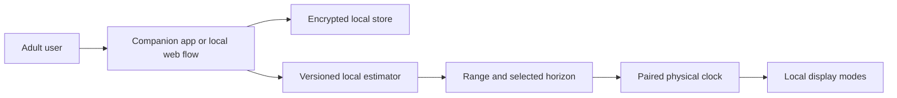
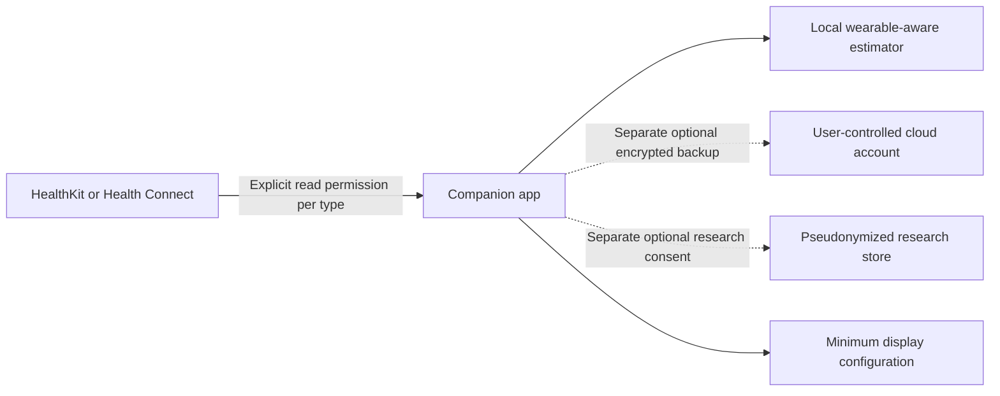

# Countdown Clock Privacy and Safety Specification

Status: Product requirement; requires jurisdiction-specific legal review before launch  
Scope: Questionnaire, companion experience, physical clock, annual refresh, research, and future wearable access  
Default: Local processing with no account and no cloud upload

## Objectives

Countdown Clock handles information about health, habits, location baseline, and an estimated lifespan range. Even when the product is positioned for general wellness, users will reasonably consider this data highly sensitive.

The design must:

- Collect only data with a documented purpose
- Keep health answers on the user's companion device by default
- Put only the minimum configuration needed for display on the clock
- Avoid accounts, cloud storage, advertising identifiers, and third-party analytics in the MVP
- Separate product operation, reminders, research, and marketing consent
- Make export and deletion understandable and immediate
- Keep mortality-related modes voluntary, calm, and easy to hide
- Prevent a purchaser from configuring a private estimate for another person without that person's consent

This document sets a strong market-neutral baseline. It is not a substitute for legal advice in each launch and shipping jurisdiction.

## Data-flow architecture

### Default local flow

The physical clock should receive only what it needs to display enabled modes:

- Current time and timezone configuration
- Birth timestamp only if time-lived or percentage modes require it
- Selected illustrative target timestamp and persistent estimate label
- Goal/habit timestamps and user-selected short labels
- Brightness, quiet hours, and mode order
- Calculation/model identifier sufficient to show provenance in the companion

Raw questionnaire responses, diagnosis selections, free text, and wearable records must not be transferred to the clock.

### Optional future services

Dotted flows are not part of the default MVP. Refusing them must not disable purchased clock features.

## Data inventory

### A. Ordinary clock configuration

Examples:

- Timezone
- Brightness and quiet hours
- Enabled modes and order
- Goals and habit timestamps
- Short user labels

Classification: Personal data, potentially sensitive depending on labels.  
Default location: Companion and clock.  
Use: Operate requested features.  
Cloud: No.

Avoid free-form labels on the MVP clock if they cannot be protected from someone nearby. If labels are supported, warn that they appear on a shared physical display.

### B. Baseline identity-adjacent data

Examples:

- Date/time of birth
- Country or region representing adult-life exposure
- Selected life-table category

Classification: Personal data; date of birth is a strong re-identification attribute.  
Default location: Encrypted companion storage. Birth timestamp may be sent to the clock only for exact time-lived calculation.  
Use: Chronological modes and population baseline.  
Cloud: No.

Do not collect legal name, precise home address, contact list, government identifier, ethnicity, or gender identity for the MVP estimate.

### C. Health and lifestyle answers

Examples:

- Height, weight, and self-rated health
- Tobacco and alcohol use
- Activity, sleep, and diet
- Diagnosed-condition selections and functional ability
- Family and social context

Classification: Sensitive health/lifestyle data and, in some jurisdictions, legally protected special-category data.  
Default location: Encrypted companion storage only.  
Use: Calculation only where a validated model supports the exact input; otherwise private context summary.  
Cloud: No.

### D. Derived estimate

Examples:

- Lower, central, and upper age
- Selected target timestamp
- Model and source versions
- Missing-data and applicability flags

Classification: Sensitive inferred health data even when labelled illustrative.  
Default location: Companion; minimum selected output on clock.  
Use: Explain and display the optional planning horizon.  
Cloud: No.

Never treat derived data as less sensitive than raw answers.

### E. Wearable records — future only

Potential data:

- Daily steps
- Sleep duration/session
- Resting heart rate
- Data source, timestamps, and wear-time/quality indicators

Classification: Sensitive health/fitness data.  
Default location: Platform health store and temporary/local aggregates in the companion.  
Use: A separately validated wearable model.  
Cloud: No by default.

Do not request location routes, reproductive health, clinical records, contacts, microphone, raw ECG, blood glucose, or other fields merely because the platform exposes them.

### F. Diagnostics and analytics

Allowed MVP diagnostics:

- App version
- Clock firmware version
- Error code
- Non-sensitive feature event, only if strictly necessary and disclosed

Prohibited default telemetry:

- Questionnaire responses
- Estimate ages or target date
- Birth date
- Diagnoses
- Wearable values
- User-entered goal names
- Advertising identifiers
- Session replay or screen capture in questionnaire/result screens

Prefer an explicit “Export support bundle” initiated by the user over automatic logging.

## Purpose and consent register

Each data field must be mapped to one purpose before implementation:

1. Ordinary clock operation
2. Time-lived calculation
3. Population baseline
4. Validated personalized estimate
5. Annual reminder
6. Optional encrypted backup
7. Optional product research
8. Marketing

Rules:

- One consent must not cover unrelated purposes.
- Health calculation consent must not imply research, analytics, backup, or marketing consent.
- Research and marketing choices default off.
- Permission refusal must not block goal-only use.
- The UI must show which answers actually affect the current model.
- If a context-only field later becomes a model input, explain the new purpose and ask again before using it.
- Record consent text version, timestamp, purpose, and withdrawal locally; cloud consent records are stored only if the cloud purpose is enabled.

In jurisdictions applying GDPR-like rules, health data may be a special category under Article 9 and will also need an Article 6 lawful basis. Explicit consent must be specific and informed, and data minimization remains required. Obtain counsel rather than assuming that a disclaimer resolves this.

## Local storage requirements

### Companion

- Use an encrypted database or encrypted file container.
- Protect encryption keys with the operating system keychain/keystore and hardware-backed storage when available.
- Do not place sensitive values in unencrypted preferences, browser local-storage APIs without a reviewed threat model, logs, crash reports, notification text, screenshots, or clipboard.
- Lock sensitive screens after a configurable period and use device authentication before export or full result viewing where available.
- Mark health and result screens to discourage operating-system snapshots in the app switcher.
- Backups created by the operating system must exclude the sensitive database unless an encrypted, disclosed backup path is intentionally supported.
- Store canonical units and validate values; retain the user's display-unit choice separately.
- Store raw answers separately from result snapshots and ordinary clock configuration.

A browser-only local implementation must be reviewed carefully: browser storage, Web Bluetooth support, device sharing, and backup behavior vary. Native mobile secure storage may be the safer production companion even if a web prototype is used initially.

### Physical clock

- Store no raw questionnaire or wearable data.
- Protect pairing and update commands against unauthorized nearby devices.
- Require physical confirmation for first pairing and factory reset.
- Do not reveal the horizon automatically after reset or unboxing.
- Provide a quick physical gesture to switch to a neutral clock face.
- Clear personal configuration during factory reset and verify erasure in testing.
- Keep debug interfaces disabled or authenticated in production firmware.

The clock is visible to family, coworkers, visitors, or customers. Treat display privacy as part of the threat model, not only database security.

## Pairing and transport security

- Use authenticated Bluetooth pairing with physical user confirmation.
- Encrypt application messages in addition to relying on reviewed platform transport where appropriate.
- Reject replayed, stale, malformed, or unsigned firmware/update messages.
- Bind a clock to a companion only after the clock displays a code or the user presses a physical control.
- Show all currently paired companions and provide “remove all pairings.”
- Transfer configuration atomically so partial updates cannot corrupt timestamps.
- Send no raw health answer to the clock even temporarily.
- Use signed firmware updates, rollback protection, and a published vulnerability-contact process before shipping.

## Data minimization decisions

The MVP should not collect:

- Name, email, or phone number to perform local setup
- Precise geolocation
- Citizenship or ethnicity
- Employer, income, or insurance information
- Medical records
- Medication list
- Genetic data
- Psychiatric diagnosis or self-harm answers
- Contacts or social graph
- Third-party advertising identifiers

The country/region item should describe the life-table reference rather than secretly reading GPS. The app must explain why date of birth and a life-table category are requested.

## Retention policy

### Default local use

- Questionnaire answers: Retain locally until the user deletes them or resets the companion; remind the user during annual review that they remain stored.
- Result snapshots: Retain locally only while history is enabled. Offer “keep latest only.”
- Clock configuration: Retain until overwritten or factory reset.
- Temporary calculation data: Clear immediately after creating the result snapshot.
- Support bundle: Generate only on request and delete locally after sharing or after seven days, whichever comes first.

Local retention is still retention. Make deletion controls available without requiring support contact.

### Optional future cloud backup

If implemented:

- Opt-in only, with end-to-end or client-side encryption where feasible.
- Define exactly which fields are backed up before consent.
- Delete active copies promptly after user deletion and expire backups on a disclosed schedule, targeted at no more than 30 days unless law requires otherwise.
- Do not retain health data after account closure for product analytics.
- Document subprocessors, regions, cross-border transfers, access controls, and government-request handling.

### Optional research

- Use a consent form separate from product operation.
- State research question, exact fields, recipients, retention period, withdrawal limits, and whether results may be commercialized.
- Replace direct identifiers with random research IDs, but call data pseudonymized unless re-identification is no longer reasonably possible.
- Keep the linkage key separate and access-controlled.
- Set a defined review date and deletion date; 24 months is a reasonable starting maximum for exploratory product research unless a reviewed protocol justifies longer.
- Do not condition product functionality or rewards on participation.
- Obtain ethics/IRB review when the project becomes human-subject research or seeks generalizable health evidence.

## User rights and controls

The companion must provide:

- **Review:** See all stored answers, result snapshots, clock configuration, permissions, and consent choices.
- **Correct:** Edit any answer and see when it was last changed.
- **Export:** Download a human-readable file and a structured file. Warn that exports contain sensitive data.
- **Delete health profile:** Remove questionnaire, results, and wearable aggregates while keeping ordinary clock settings.
- **Delete one result:** Remove an individual annual snapshot.
- **Revoke pairing:** Remove a companion or clock.
- **Factory reset:** Remove all personal configuration from the clock.
- **Withdraw reminder consent:** Stop annual reminders immediately.
- **Withdraw research/backup consent:** Stop future processing and explain any lawful or technical retention limits.
- **Goal-only conversion:** Replace the lifespan view without losing goal and habit modes.

Deletion should complete locally immediately. If optional services exist, show service-side deletion progress and confirmation. Never require the user to state a reason.

## Emotional safety requirements

### Onboarding

- Health and mortality modes are opt-in and 18+.
- Show uncertainty and non-medical boundaries before collecting health answers.
- Include the comfort check from the questionnaire.
- Route “distressing or harmful” responses to goal-only setup without argument or repeated prompts.
- Show the range before offering a single target.
- Require a simple comprehension check before enabling the countdown.

### Ongoing display

- Provide a one-action switch to current-time or goal mode.
- Let users hide all lifespan modes permanently.
- Do not send “time is running out,” loss, danger, or urgency notifications.
- Do not use red alerts, skull imagery, alarming sounds, vibration, streak loss, or shame.
- Do not automatically shorten a visible horizon after an annual update.
- Do not show an estimate on a lock-screen notification or widget unless separately requested and previewed.
- Do not compare horizons between users or publish leaderboards.

### Shared and gifted devices

- A gift purchaser cannot answer health questions for the recipient.
- The device arrives in neutral ordinary-clock mode.
- The recipient performs consent and setup privately.
- Include a neutral display-privacy warning for office or household use.
- Provide guest-safe ordinary clock mode.

### Distress response

The product is not a crisis service. It should not collect free-text distress reports or attempt diagnosis. If a user actively seeks help from a support surface, provide a short statement to stop using the horizon mode and seek local professional or emergency support when they may be in immediate danger. Localize help information through a reviewed provider rather than hard-coding one country's service globally.

## Security threat model

Review at least these threats:

1. Lost or shared phone exposes health answers.
2. Coworkers or family infer a private horizon from the display.
3. An unauthorized nearby phone changes a clock.
4. Debug logs or crash services capture questionnaire data.
5. A malicious firmware image extracts configuration.
6. Optional cloud credentials are compromised.
7. Research data is re-identified through birth date, region, and rare diagnoses.
8. Support staff request or receive more health data than needed.
9. A user is coerced to share their result.
10. A purchaser configures an estimate for another person.
11. Old model/source data remains presented as current.
12. Deleted data remains in backups or paired devices.

For each release, record likelihood, impact, mitigation, owner, and residual risk. Perform application and firmware penetration testing before fulfillment.

## Operational access

For the local-only MVP, company staff should have no routine access to questionnaire or result data.

If cloud or research services are later added:

- Use least privilege and role-based access.
- Require phishing-resistant multi-factor authentication for production access.
- Log sensitive-data access and review logs regularly.
- Separate production, support, analytics, and research permissions.
- Prohibit copying production health data into development or ticketing tools.
- Use synthetic data for testing.
- Time-limit emergency access and review every use.
- Maintain data-flow diagrams, asset inventory, dependency scanning, patch SLAs, backups, and incident exercises.

Support scripts must never ask users to send screenshots of health answers or result pages by default.

## Incident response

Before campaign fulfillment, define:

- Security and privacy incident owners
- Public vulnerability-reporting contact
- Triage and severity criteria
- Procedures to contain, preserve evidence, rotate credentials, patch firmware/apps, and notify users
- Jurisdiction-specific notification decision process
- Handling for a harmful or misleading estimate, not only a technical breach
- Process to withdraw or correct a model/source version

If an estimate defect is found, disable new affected calculations, preserve ordinary clock modes, notify impacted users in neutral language, and offer deletion/recalculation. Do not silently change existing horizons.

## Future wearable integration

### Integration order

1. Validate product demand without wearable access.
2. Define a statistical model that needs specific longitudinal signals.
3. Integrate Apple HealthKit and Android Health Connect in read-only mode.
4. Test data completeness, device disagreement, subgroup performance, and user understanding.
5. Seek renewed scientific, privacy, store-policy, and regulatory review.
6. Only then consider making wearable-informed results public.

Building a proprietary wearable should be a separate product program after these steps. It adds sensor validation, hardware support, manufacturing, battery, safety, certification, and likely broader regulatory analysis.

### Permission rules

- Request each data type only when the user enables wearable mode.
- Explain the purpose beside the system permission prompt.
- Request read access, not write access.
- Permit partial permission; explain which calculation cannot run rather than repeatedly prompting.
- Make revocation easy and honor it immediately.
- Do not infer denial status beyond what the platform reveals.
- Never use health-store data for advertising, credit, employment, insurance, or data brokerage.

Apple HealthKit uses fine-grained authorization by data type; see [Authorizing access to health data](https://developer.apple.com/documentation/healthkit/authorizing-access-to-health-data). Android Health Connect similarly defines permissions for individual records such as [steps, sleep, and resting heart rate](https://developer.android.com/health-and-fitness/health-connect/data-types). Store policies and platform terms must be rechecked at implementation time.

### Candidate data contract

For each approved type, record:

- Platform record type and permission
- Unit and timezone
- Source device/app
- User-entered versus device-recorded provenance
- Aggregation period
- Deduplication priority
- Minimum valid days and wear time
- Missingness and outlier behavior
- Local retention period
- Model version using it

Suggested research candidates:

- Daily steps summarized over 30–90 days
- Sleep duration summarized over 30–90 days
- Resting heart rate summarized only when source and coverage meet the model definition

Do not merge data from multiple sources by naive summation. Do not present a poor-data warning as a medical abnormality.

### Recalculation cadence

- Aggregate locally.
- Recalculate no more often than monthly or quarterly unless a validated model specifies otherwise.
- Require sufficient recent data before changing a result.
- Show survey-only and wearable-informed results separately.
- Require confirmation before updating the physical horizon.
- Never make the countdown jump continuously with daily sensor noise.

## Regulatory and policy boundary

The intended use must remain motivational general wellness and unrelated to diagnosis, cure, mitigation, prevention, or treatment of disease. In the United States, the FDA's [General Wellness policy](https://www.fda.gov/regulatory-information/search-fda-guidance-documents/general-wellness-policy-low-risk-devices) is relevant but not automatically determinative. Other markets have different medical-device, consumer-protection, product-safety, and health-data rules.

Before selecting launch markets:

- Review medical-device classification and wellness guidance
- Review health/privacy, children's, biometric, consumer-protection, and data-transfer laws
- Review Apple, Google, Kickstarter, payment, and app-store policies
- Validate disclaimers and marketing claims with counsel
- Complete a data-protection impact assessment where required or prudent
- Establish a legal entity/controller identity and contact channel for privacy requests

A disclaimer cannot cure a product whose actual design or marketing makes a medical claim.

## Privacy notice outline

The launch privacy notice should state, in plain language:

1. Who operates the product and how to contact them
2. Which data is collected for each mode
3. Which data stays on the companion and clock
4. Which optional data leaves the device, if any
5. Why each category is used
6. Legal basis and special-category condition by jurisdiction
7. Retention and deletion
8. Security approach and its limits
9. User choices and rights
10. Optional research, backup, wearable, and marketing terms
11. Service providers and international transfers
12. Age restriction
13. Policy/version changes
14. Complaint and regulator contacts where applicable

Do not claim “we collect no data” if the app or clock stores it locally. Say “we do not receive your health answers by default” when that is accurate.

## Launch checklist

Privacy and safety are not ready until:

- The default data-flow test shows no health traffic leaving the companion
- Packet capture verifies clock pairing and configuration behavior
- Raw health answers never reach the clock
- Sensitive fields are absent from logs, crash reports, analytics, notifications, and backups
- Export and all deletion paths work offline
- Factory reset and unpairing are verified
- Consent purposes and versions are recorded
- Under-18 and distress routes end the lifespan flow
- Gifted-device setup starts neutral
- Comprehension testing meets the product target
- Threat model and penetration tests have no unresolved high-severity findings
- Source/model withdrawal can be executed without disabling ordinary clock modes
- Privacy, consumer-protection, Kickstarter, and app-store copy has been reviewed for intended launch markets
- Future features are described as roadmap, not as data collection already occurring
